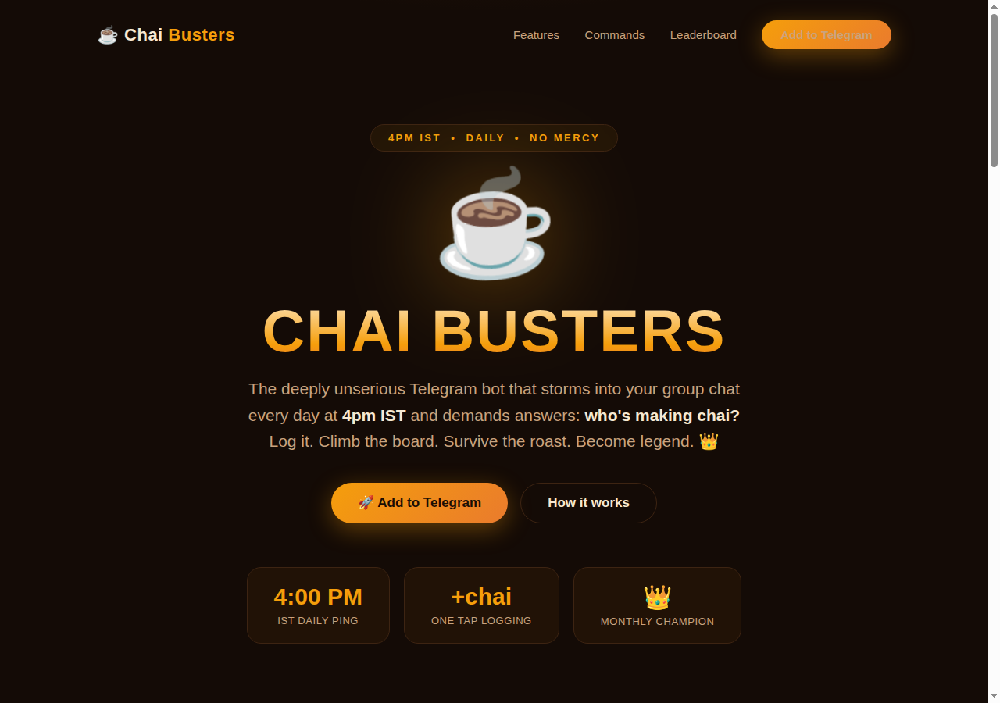
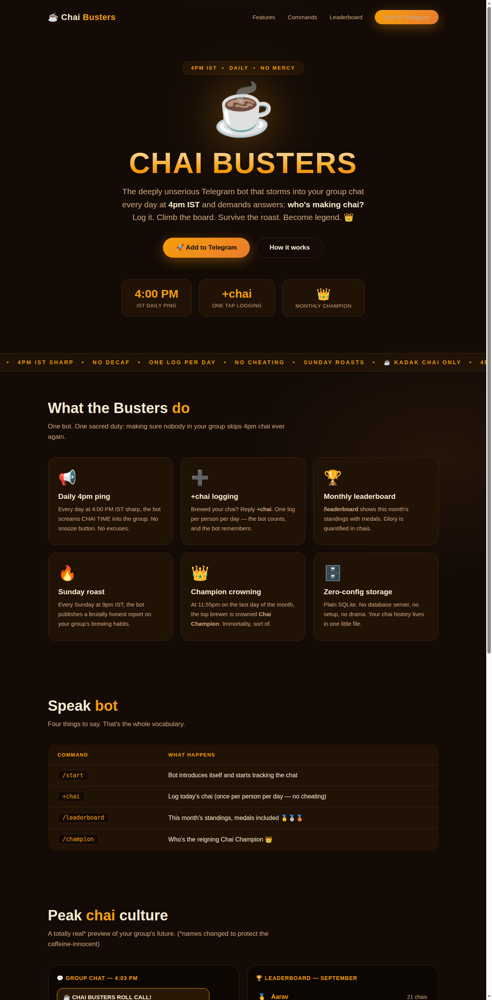

# ☕ Chai Busters

[](https://www.python.org/)
[](https://t.me/Kadak_chai_ahhh_bot)
[]()
[]()
[](LICENSE)

> **The deeply unserious Telegram bot that holds your entire group chat accountable for 4pm chai.**

Every day at **4:00 PM IST sharp**, Chai Busters storms into your group and demands answers: *who's making chai?*
Brew it, reply `+chai`, and climb the monthly leaderboard. Slack off and you'll be named, shamed, and roasted
every Sunday at 9pm. At month-end, one brewer is crowned **Chai Champion** 👑. There is no higher honor.

🤖 **Try the live bot:** [t.me/Kadak_chai_ahhh_bot](https://t.me/Kadak_chai_ahhh_bot)

---

## 📸 Screenshots

The landing page (`site/index.html`) — dark, kadak, and proud of it:





---

## ✨ Features

| | |
|---|---|
| 📢 **Daily 4pm ping** | Screams CHAI TIME into the group every day at 4:00 PM IST. No snooze button. |
| ➕ **+chai logging** | Reply `+chai` when your chai is brewed. One log per person per day — no cheating. |
| 🏆 **Leaderboard** | `/leaderboard` — this month's standings with 🥇🥈🥉 medals. Glory, quantified. |
| 🔥 **Sunday roast** | Every Sunday 9pm IST: a brutally honest report on your group's brewing habits. |
| 👑 **Champion crowning** | 11:55pm on the last day of the month — the top brewer becomes Chai Champion. |
| 🗄️ **Zero-config storage** | Plain SQLite. No database server, no setup, no drama. |

## 🎮 Commands

| Command | What it does |
|---|---|
| `/start` | Bot introduces itself, starts tracking the chat |
| `+chai` | Log today's chai (once per person per day) |
| `/leaderboard` | This month's chai standings with medals |
| `/champion` | The reigning Chai Champion 👑 |

## 🚀 Setup (5 minutes)

### 1. Create the bot
1. Open Telegram and chat with **[@BotFather](https://t.me/BotFather)**
2. Send `/newbot`, pick a display name (we went with **Chai Busters ☕**) and a username ending in `bot`
3. Copy the **token** BotFather gives you — keep it secret, keep it safe
4. Send `/setprivacy` → select your bot → **Disable**, so it can see `+chai` replies in groups (commands work either way)
5. Add the bot to your group chat and send `/start`

### 2. Run it
```bash
git clone <this-repo>
cd chai-busters
pip install -r requirements.txt
export TELEGRAM_BOT_TOKEN="your-token-here"
python bot.py
```

### 3. Deploy free on Railway
1. Push this folder to a GitHub repo
2. Railway → **New Project → Deploy from GitHub**
3. Set the **start command** to `python bot.py`
4. Add env var `TELEGRAM_BOT_TOKEN` = your token
5. *(Optional but smart)* Add a **Volume** mounted at `/data` and set `DATABASE_PATH=/data/chai_busters.db` so the leaderboard survives redeploys

That's it. At 4pm IST tomorrow, your group gets yelled at. ☕

## 🧠 How it works

```
4:00 PM IST ──▶ daily_chai_ping() ──▶ every tracked chat gets CHAI TIME
     │
     ▼ "+chai" in any message
handle_message() ──▶ SQLite: one row per (chat, user, day)
     │
     ├── /leaderboard ──▶ GROUP BY user, ORDER BY count  →  🥇🥈🥉
     ├── Sunday 9pm ──▶ weekly_roast() — top brewer praised, rest roasted
     └── month-end 11:55pm ──▶ maybe_crown_champion()  →  👑 recorded forever
```

- **Stack:** Python 3.12, `python-telegram-bot` (with job-queue), SQLite
- **Scheduling:** `job_queue.run_daily` with `Asia/Kolkata` timezone — no cron needed
- **Security:** user names are stored **raw** in the DB and escaped for Telegram Markdown **only at render time**, so `*hacker*`-style names can't inject formatting or double-escape

## 🗂️ Project structure

```
chai-busters/
├── bot.py            # the bot: handlers, jobs, scheduling
├── db.py             # SQLite layer (chats, chai_events, champions)
├── messages.py       # all personality: pings, praise, roasts
├── site/
│   ├── index.html    # dark chai-themed landing page
│   └── screenshots/  # page screenshots (see above)
├── Dockerfile        # container deploy
├── Procfile          # Railway/Heroku worker
├── requirements.txt  # pinned deps
└── NEW_TOPICS.md     # five more silly bot ideas, free of charge
```

## 🤝 Contributing

Found a better roast? A spicier ping? PRs welcome — the bar is low and the chai is kadak.
All personality lives in `messages.py`; add your roasts liberally. Please keep it fun, never mean.

## 📜 License

MIT — do whatever you want, just make chai while you do it. See [LICENSE](LICENSE).

---

<p align="center">
  <b>☕ Chai Busters</b> — because decaf is a rumor and 4pm is sacred.<br>
  <a href="https://t.me/Kadak_chai_ahhh_bot">t.me/Kadak_chai_ahhh_bot</a>
</p>
