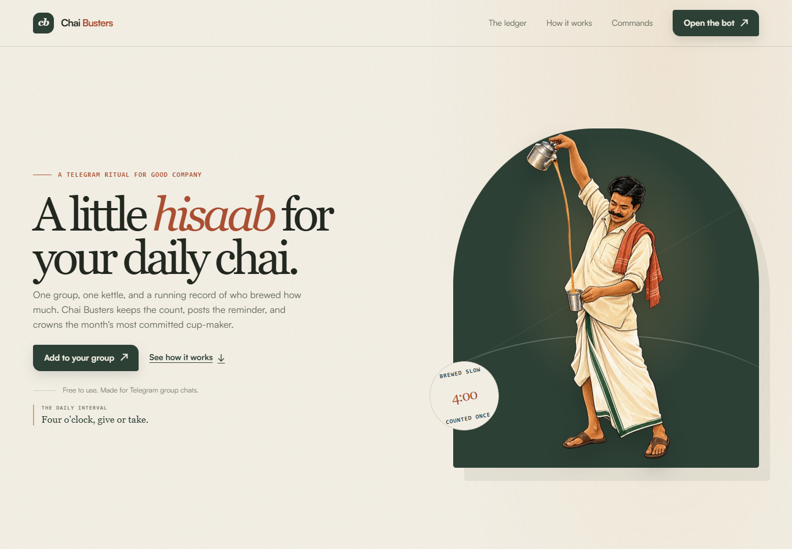
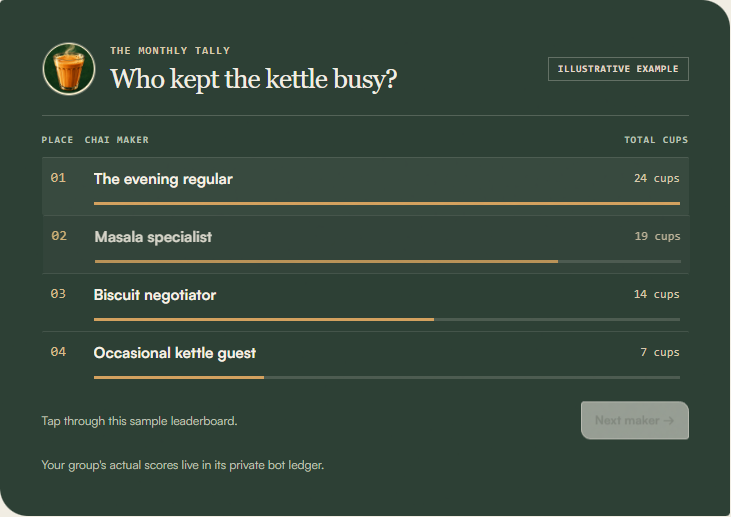

# Chai Busters

**A Telegram chai poll and group ledger.** Start a chai poll, count the cups, and see who earned this month's kettle crown.

<p align="center">
  
</p>

<p align="center">
  <a href="https://chai-busters.kadakchai-panda.workers.dev">Open the live site</a> ·
  <a href="https://t.me/Kadak_chai_ahhh_bot">Open the Telegram bot</a> ·
  <a href="https://github.com/sarcasticpanda/chai-busters">GitHub repository</a>
</p>

## The live project

| | |
| --- | --- |
| Website | [chai-busters.kadakchai-panda.workers.dev](https://chai-busters.kadakchai-panda.workers.dev) |
| Telegram bot | [@Kadak_chai_ahhh_bot](https://t.me/Kadak_chai_ahhh_bot) |
| Hosting | Cloudflare Workers, with the landing page and bot webhook on one Worker |
| Database | Cloudflare D1 (`chai-busters`), shared by all groups but separated by group ID |
| Source | [github.com/sarcasticpanda/chai-busters](https://github.com/sarcasticpanda/chai-busters) |

## Screenshots

The current live landing page and its sample leaderboard:





The avatar above is also the tea image used on the live Telegram bot profile.

## How the bot works

1. Add the bot to a Telegram group and send `/start`.
2. When someone is making chai, they send `/chai`. Telegram opens a 10-minute yes/no poll.
3. The brewer gets one cup automatically. Each other member who votes **Haan** adds one cup to the brewer's daily total. Changing a vote updates the count; it does not add a duplicate. The brewer's own poll vote cannot add a second cup.
4. Use `/leaderboard` to see that group's monthly rankings. Cups rank first; brew rounds break ties.

The poll is non-anonymous so Telegram can identify votes for the tally. The person voting is not recorded as the brewer; the cups belong to the person who started the poll. Each group's totals stay separate.

## Commands

Telegram suggests these when you type `/` in a chat with the bot.

| Command | What it does |
| --- | --- |
| `/start` | Register the group and show the quick guide. |
| `/chai` | Start the 10-minute group poll. The brewer is counted once; each other “Haan” vote adds a cup for them. |
| `/today` or `/aaj` | See today's brewers and cup totals. |
| `/leaderboard` or `/taaj` | Rank the group's brewers for the current month. |
| `/groupstats` or `/hisab` | See group size, active brewers, brew rounds, and cups this month. |
| `/mychai` or `/mera` | See your own daily and monthly brewing totals in that group. |
| `/champion` or `/badshah` | See the latest monthly chai champion. |
| `/mood` | Pick a chai mood with buttons. |
| `/chutkula` | Get a chai joke. |
| `/help` or `/madad` | Show the command guide. |
| `+chai` / `+chai 4` | Log or set your brewed-cup total directly. |

**Note:** `/chai` works as a slash command. For plain `+chai` messages, Telegram group privacy must be disabled for this bot in BotFather; otherwise Telegram only forwards commands and mentions to it. `/banao` was retired because its old inline-button flow was unreliable; it now points to `/chai`.

## What is stored

- D1 stores Telegram group IDs, user IDs and display names, each brewer's daily cup total, poll IDs and votes, and monthly champion results.
- The bot does not use RAG or an AI model and does not store the group's full chat history.
- The production bot runs on Cloudflare Workers. The optional Python bot (`bot.py`) is a separate local version using SQLite.

## Hosting and deployment

The current production deployment is already live. To publish a code or website update, open PowerShell in `cloudflare/` and run:

```powershell
npx wrangler deploy
```

The Worker uses D1 through the `DB` binding. For a fresh setup, configure `TELEGRAM_BOT_TOKEN` and `WEBHOOK_SECRET` as Cloudflare Worker secrets, apply migrations, deploy, then connect Telegram's webhook. See [CLOUDFLARE_DEPLOY.md](CLOUDFLARE_DEPLOY.md) for the full steps and recovery notes.

Never commit `cloudflare/.telegram-token`, `cloudflare/.webhook-secret`, `.env`, or Cloudflare secret values. If a bot token is exposed, revoke it with BotFather and replace the `TELEGRAM_BOT_TOKEN` Worker secret.

## Project map

```text
site/index.html                    Live landing page
site/assets/chaiwala-pour.webp     Chaiwala hero illustration
site/assets/tea-avatar.jpg         Bot profile avatar and README tea image
cloudflare/src/worker.js           Production Telegram bot and scheduled jobs
cloudflare/migrations/             D1 schema and poll-accounting tables
cloudflare/test/poll-flow.test.mjs Poll/revote/legacy-button regression test
cloudflare/wrangler.jsonc          Worker, D1, assets, and schedule config
bot.py                              Optional local Python bot
db.py                               SQLite storage for the Python version
```

## Checks

From `cloudflare/`:

```powershell
node test/poll-flow.test.mjs
npx wrangler deploy --dry-run
```

The poll regression test covers the brewer's initial cup, yes/no vote changes, duplicate updates, self-votes, closing the poll, and retired `/banao` buttons.
